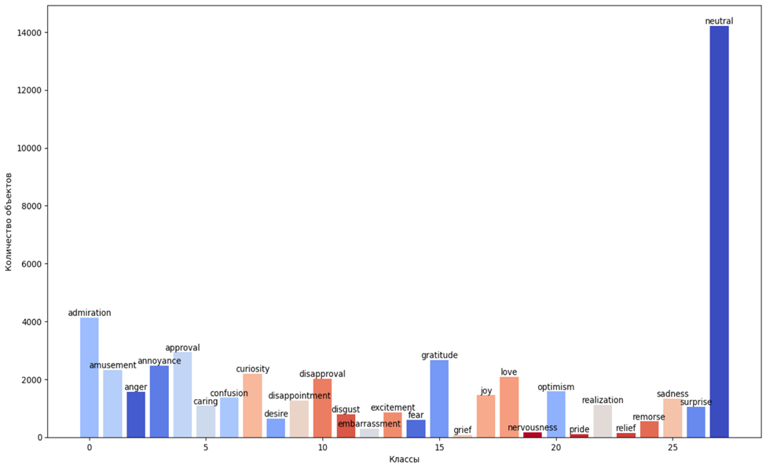
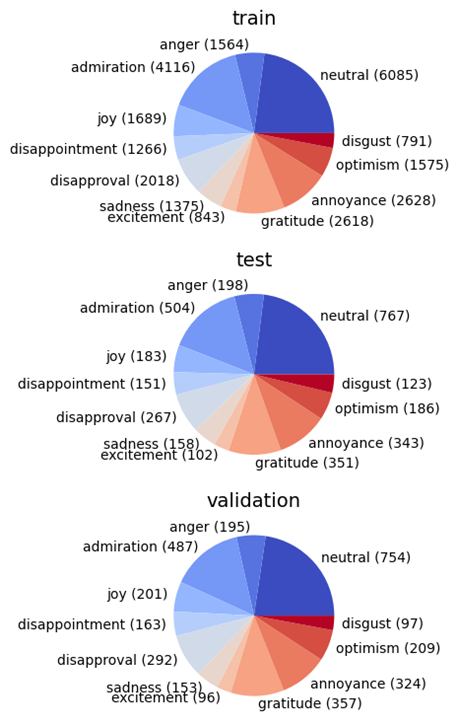
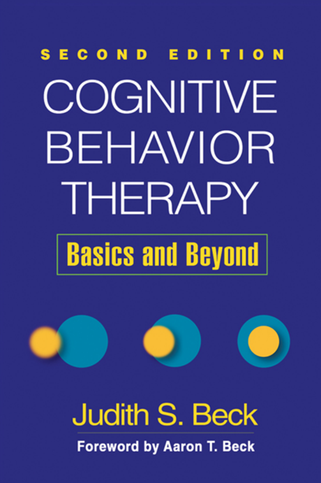
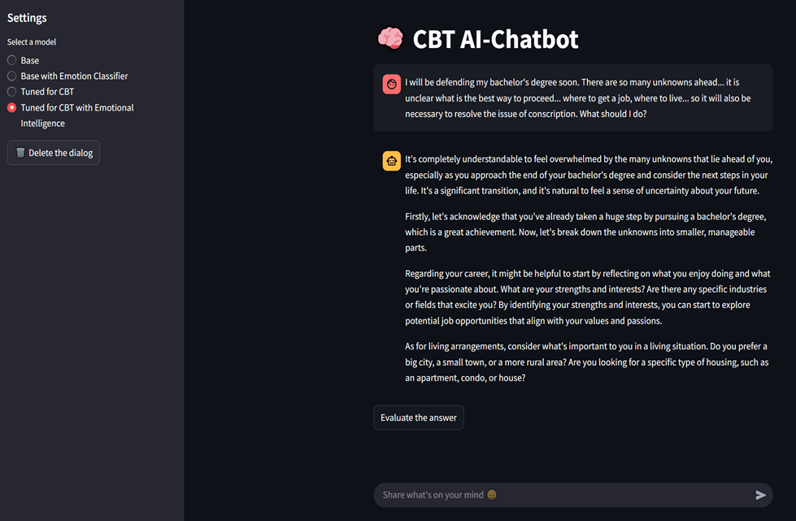
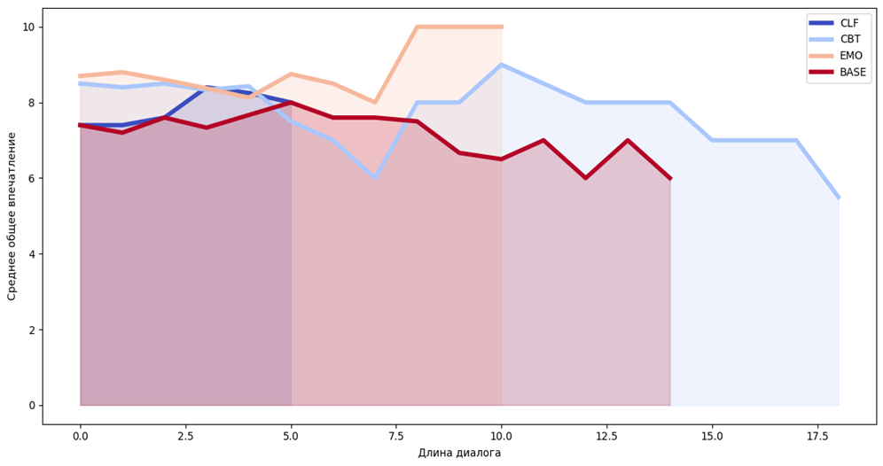
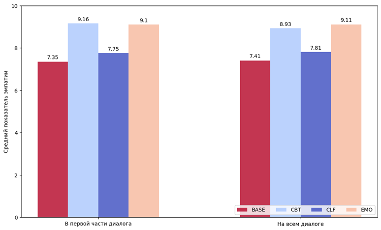
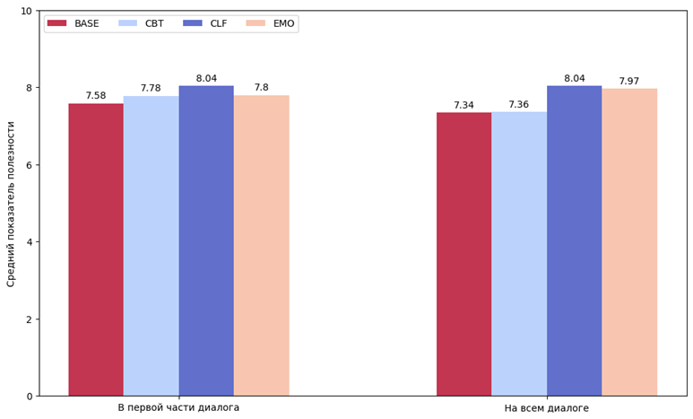
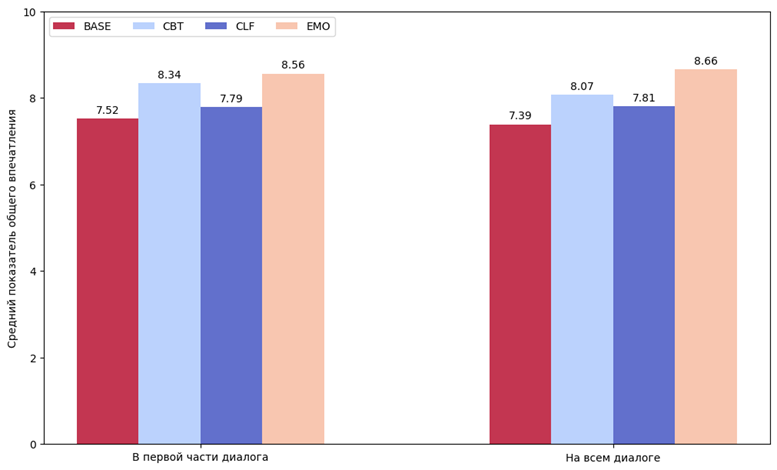

# Вопросно-ответная система на основе нейросетевой модели с эмоциональным откликом для повышения удовлетворенности пользователя

Дипломная работа. Бакалавриат 2021-2025. 01.03.04 "Прикладная математика".

Изучение влияния эмоционального интеллекта нейросетей в диалоговых системах на пользовательский опыт.

## Стек:

- DL:
    - hugging face transformers, datasets
    - peft
    - torch

- Data Analysis:
    - pandas
    - numpy
    - scipy
    - statsmodels
    - seaborn
    - matplotlib

- UI:
    - streamlit

## Deep Learning

### Обработка данных для мультиклассовой классификации

Датасет Go Emotions:
- 27 классов,
- 54000 объектов,
- Дисбаланс классов.

Гистограмма распределения объектов по классам в изначальном датасете:



После обработки:
- 12 классов, 
- 29600 объектов,
- Дисбаланс ниже.



Результаты обучения:

|Класс         |Precision|Recall|F1-score|
|--------------|---------|------|--------|
|Admiration    |0.748    |0.861 |0.801   |
|Anger	       |0.485	 |0.646	|0.554   |
|Annoyance     |0.440	 |0.504	|0.470   |
|Disappointment|0.441	 |0.325	|0.374   |
|Disapproval   |0.567	 |0.573	|0.570   |
|Disgust	   |0.644	 |0.528	|0.580   |
|Excitement	   |0.557	 |0.578	|0.567   |
|Gratitude	   |0.913	 |0.923	|0.918   |
|Joy	       |0.719	 |0.601	|0.655   |
|Optimism	   |0.641	 |0.683	|0.661   |
|Sadness	   |0.647	 |0.684	|0.665   |
|Neutral	   |0.752	 |0.565	|0.645   |


### Обработка данных для генерации текстов

#### Тонкая настройка на книге по психотерапии

- Валидация на тестах для аккредитации:
    - Результат базовой модели: 42/65 (64.62%)
    - После обучения: 44/65 (67.69%)
    - Абсолютная разница: +3.07%
    - Относительная разница: +4.75%

- Дообученная модель: 
    - Не ошиблась в новых местах
    - Улучшила результат на вопросах о 	подростках




#### Тонкая настройка на психотерапевтических датасетах
Изначально:
- 6 датасетов
- 95000 объектов суммарно

Приведение данных к единому виду:
```
PATIENT: Is it normal for people to cry during therapy, or is it just me?
THERAPIST: For many people, crying is a stress-release valve. It is perfectly OK to cry in counseling!
```

При обработке реплик пациентов классификатором выявлен перевес классов в сторону нейтрального. 

После фильтрации от только нейтральных текстов осталось 67000 объектов. 

С применением классификатора эмоций данные выглядят так:
```
PATIENT ['anger', 'annoyance']: When I'm in large crowds I get angry and I just can't deal with people. I don't really like other people.
THERAPIST: Thank you for sharing your feelings with me. It sounds like you're experiencing significant discomfort and anxiety in social…
```

Результаты обучения:
|Название датасета                    |Средние потери при обучении без эмоц. меток|Средние потери при обучении с эмоц. метками|Доля правильно предсказанных токенов при обучении без эмоц. меток|Доля правильно предсказанных токенов при обучении с эмоц. метками|
|-------------------------------------|----------------------------------|----------------------------------|----------------------------------|----------------------------------|
|Mental-health-counseling-conversations	|1.682 |1.785 |0.593 |0.572 |
|psychotherapy |1.091 |1.023 |0.688 |0.702 |
|Kurtis-mental-health-final |0.906 |0.839 |0.731 |0.747 |
|Mental-health-counseling-responses |0.484 |0.510 |0.862 |0.858 |
|MentalChat16K	|0.813 |0.745 |0.751 |0.767 |
|LLM-PsychoCounsel-Preference |0.878 |0.816 |0.738 |0.752 |


## UI



## Data Analysis
Изучение влияния эмоционального интеллекта нейросетей в диалоговых системах на пользовательский опыт.

|Конфигурация |Генератор текста|Классификатор |
|-------------|----------------|--------------|
|BASE |Без дообучения |Нет |
|CLF |Без дообучения |Да |
|CBT |Дообучение на психотерапевтических датасетах без эмоциональной разметки |Нет |
|EMO |Дообучение на психотерапевтических датасетах с эмоциональной разметкой |Да |


### Изучение данных в динамике
Впечатление в динамике диалога:


Показатели в сравнении - до середины диалога и на всем диалоге:



